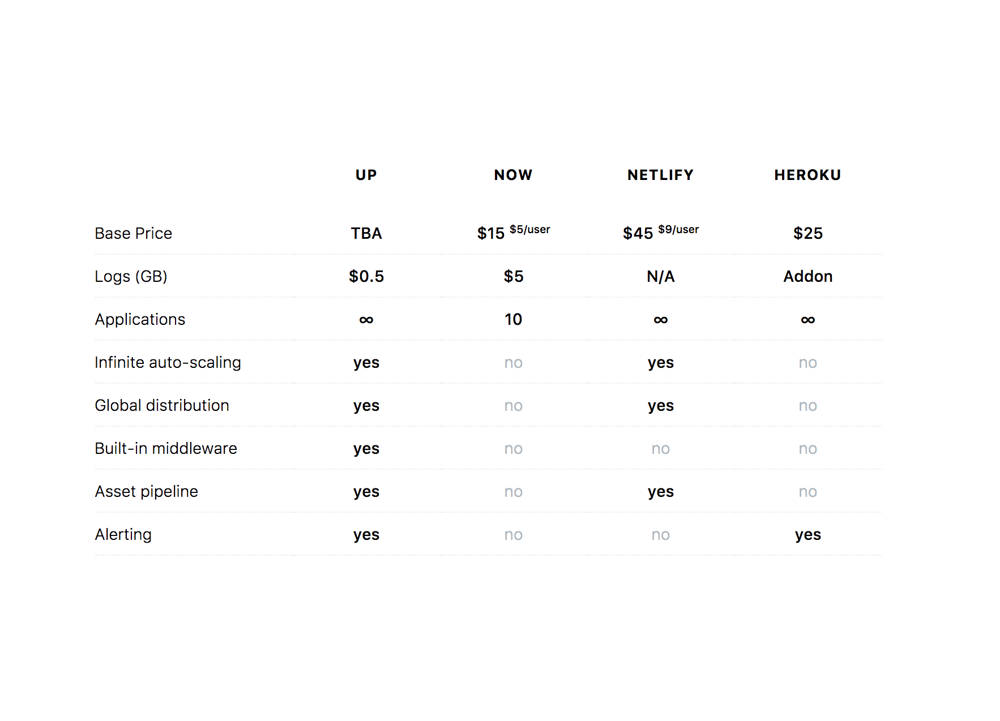

Up deploys infinitely scalable serverless apps, APIs, and static websites in seconds, so you can get back to working on what makes your product unique.

Up focuses on deploying "vanilla" HTTP servers so there's nothing new to learn, just develop with your favorite existing frameworks such as Express, Koa, Django, Golang net/http or others.

Up currently supports Node.js, Golang, Python, Crystal, and static sites out of the box. Up is platform-agnostic, supporting AWS Lambda and API Gateway as the first targets. You can think of Up as self-hosted Heroku style user experience for a fraction of the price, with the security, flexibility, and scalability of AWS.

Check out the [documentation](https://apex.github.io/up/) for more instructions, try one of the [examples](https://github.com/apex/up-examples), or chat with us in [Slack](https://apex-slackin.herokuapp.com/).


## Features

Open source community edition.


## Pro Features

Close sourced pro edition: Coming less soon.


## Pricing

Updated as of July 2017 based on public information. Some services offer a restricted free version, or free access for solo developers – this table is based on commercial use.



## Quick Start

Install Up:

```
$ curl -sfL https://raw.githubusercontent.com/apex/up/master/install.sh | sh
```

Tell up which AWS profile to use:

```
export AWS_PROFILE=example
```

Create an `app.js` file:

```js
require('http').createServer((req, res) => {
  res.end('Hello World\n')
}).listen(process.env.PORT)
```

Deploy the app:

```
$ up
```

Open it in the browser:

```
$ up url --open
```

## Community

- [Documentation](https://apex.github.io/up/)
- [Example applications](https://github.com/apex/up-examples)
- [Twitter](https://twitter.com/tjholowaychuk)
- [Slack](https://apex-slackin.herokuapp.com/) to chat with apex(1) and up(1) community members
- [Blog](https://blog.apex.sh/) to follow release posts, tips and tricks
- [Wiki](https://github.com/apex/up/wiki) for article listings, database suggestions, etc

<a href="https://apex.sh"></a>
